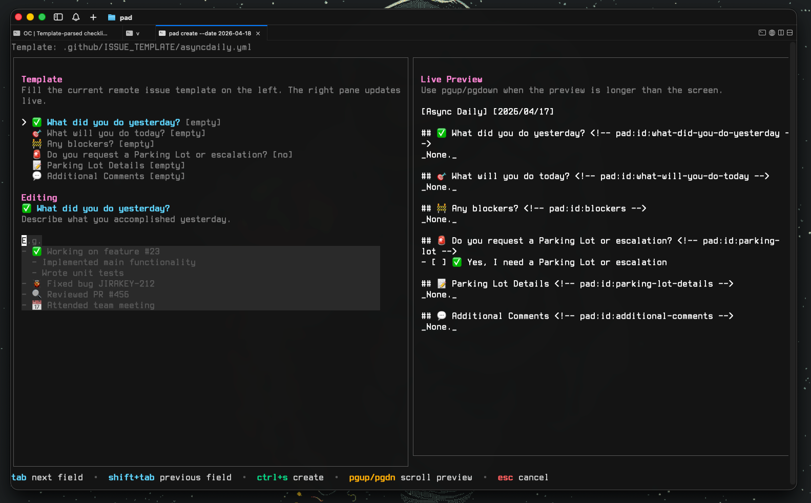

<p align="center">
  
</p>

# pad

`pad` is a small CLI with a simple terminal UI that helps teams draft and publish daily standup updates without repeating the same manual steps every day.

Current first iteration focuses on the fastest useful workflow:

- open a split editor with live preview directly from `pad create`
- prefill from your latest GitHub daily update issue with `pad repeat`
- list your already-published daily updates directly from GitHub with `pad list`
- read the merged team report issue with `pad report`
- preview the rendered GitHub issue body with `pad show` or `pad create --dry-run`
- create the GitHub issue in your configured repository with `pad create`

<p align="center">
  
</p>

## Installation

### Quick Install (Recommended)

```bash
curl -fsSL https://raw.githubusercontent.com/vieitesss/pad/main/scripts/install.sh | sh
```

Install to a custom directory:

```bash
curl -fsSL https://raw.githubusercontent.com/vieitesss/pad/main/scripts/install.sh | INSTALL_DIR=/usr/local/bin sh
```

### Build from Source

Requirements:

- Go 1.25+
- `gh` installed and authenticated with `gh auth login`

```bash
go build -o pad .
```

## Setup

Create the default config:

```bash
./pad init
```

This creates a TOML config file at the platform-appropriate location:

- Linux/macOS: `~/.config/pad/pad.toml` (or `$XDG_CONFIG_HOME/pad/pad.toml`)
- Windows: `%APPDATA%\pad\pad.toml`

Example config:

```toml
github_repo = "owner/repo"
labels = ["daily-update"]
issue_template = ".github/ISSUE_TEMPLATE/daily-update.yml"
```

Configure your repository:

```bash
./pad init --repo owner/repo --labels daily-update
```

Use a different remote issue template path:

```bash
./pad init --repo owner/repo --labels daily-update --issue-template .github/ISSUE_TEMPLATE/team-standup.yml
```

## Repository Setup

To use `pad` with your team, you need a GitHub repository with an issue template.

### 1. Create a Repository

Create a repository (e.g., `your-org/dailies` or `your-org/standups`).

### 2. Add the Issue Template

Copy the issue template from this repository:

- [`.github/ISSUE_TEMPLATE/daily-update.yml`](.github/ISSUE_TEMPLATE/daily-update.yml)

Place it in your repository at the same path, or configure a different path with `issue_template` in `pad.toml`. `pad` fetches the template from GitHub before opening the TUI, builds the editor fields dynamically from the template, and reuses stable field IDs when repeating older entries.

### 3. (Optional) Set Up Automated Workflows

This repository includes ready-to-use GitHub Actions workflows:

**Publish Team Digest** (`.github/workflows/publish-team-digest.yml.example` → rename to `.yml`)
- Collects all daily issues from team members
- Generates a merged report with parking lot items highlighted
- Closes individual issues after including them in the report
- Runs weekdays at 10:45 AM UTC (customize the cron schedule as needed)

**Refresh Daily Update Template** (`.github/workflows/refresh-daily-update-template.yml.example` → rename to `.yml`)
- Automatically updates the issue template date to tomorrow
- Runs daily at 12:00 PM UTC

To use these workflows:

1. Copy the workflow files from `.github/workflows/` to your repository (remove `.example` extension)
2. Copy the Python helper scripts from `.github/scripts/` to your repository
3. Set up repository variables (optional):
   - `DAILY_UPDATE_LABEL`: Label for individual updates (default: `daily-update`)
   - `DAILY_REPORT_LABEL`: Label for report issues (default: `daily-update/report`)
4. The reporter workflow uses `GITHUB_TOKEN` which is automatically available

The report issue title follows this format: `[Daily Report] YYYY/MM/DD`

### 4. Configure `pad`

Each team member runs:

```bash
pad init --repo your-org/dailies --labels daily-update
```

## Shell Completion

`pad` exposes shell completions through Cobra's built-in `completion` command.

If `pad` is installed in your `PATH`, use `pad completion <shell>`.
If you are still running it from a checkout, use the absolute path to the built binary instead of `pad` in the examples below.

Bash:

Add this line to `~/.bashrc`:

```bash
source <(pad completion bash)
```

Then open a new shell or run:

```bash
source ~/.bashrc
```

Zsh:

Make sure completion is enabled in `~/.zshrc`:

```bash
autoload -U compinit
compinit
source <(pad completion zsh)
```

Then open a new shell or run:

```bash
source ~/.zshrc
```

Fish:

Write the completion file once:

```bash
mkdir -p ~/.config/fish/completions
pad completion fish > ~/.config/fish/completions/pad.fish
```

Then start a new Fish shell.

PowerShell:

Load it for the current session:

```powershell
pad completion powershell | Out-String | Invoke-Expression
```

Persist it in your PowerShell profile:

```powershell
if (!(Test-Path $PROFILE)) { New-Item -ItemType File -Force $PROFILE | Out-Null }
'pad completion powershell | Out-String | Invoke-Expression' | Add-Content $PROFILE
```

Then restart PowerShell.

## Main Usage

Open the daily update editor for today. The left pane shows the template fields, the right pane shows a live preview, and `pad` asks for confirmation before publishing:

```bash
./pad create
```

Repeat from your latest GitHub daily update issue into today's editor and create a new issue:

```bash
./pad repeat
```

Repeat into a different date:

```bash
./pad repeat --date 2026-04-17
```

Preview today's rendered issue body:

```bash
./pad show
```

`pad show --date YYYY-MM-DD` reads the issue already published in GitHub.

Open the editor for a specific date and create that issue:

```bash
./pad create --date 2026-04-16
```

Open the editor and print the exact title and body without publishing:

```bash
./pad create --dry-run
```

List your daily update issues from GitHub:

```bash
./pad list
```

Show today's merged team report issue:

```bash
./pad report
```

Show the merged report for a specific date:

```bash
./pad report --date 2026-04-16
```

List recent merged report issues:

```bash
./pad report --list
```

## Auto-Update Check

`pad` automatically checks for new releases once per day. When an update is available, you'll see a notice after any command:

```
→ v0.2.0 is available. Run pad upgrade to update.
```

## Upgrade

Update to the latest release:

```bash
pad upgrade
```

This downloads the latest release from GitHub and replaces the current binary.
